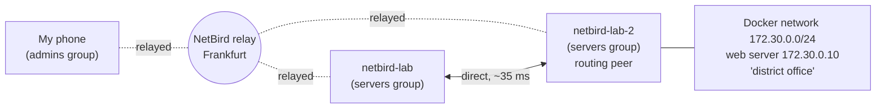
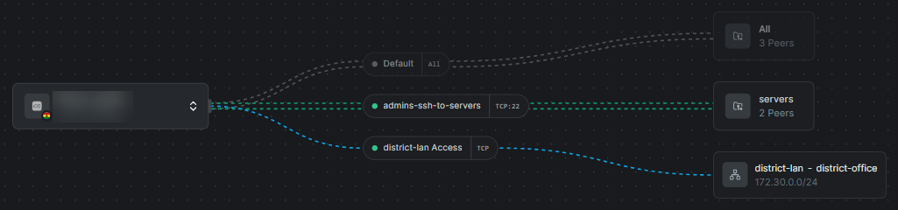
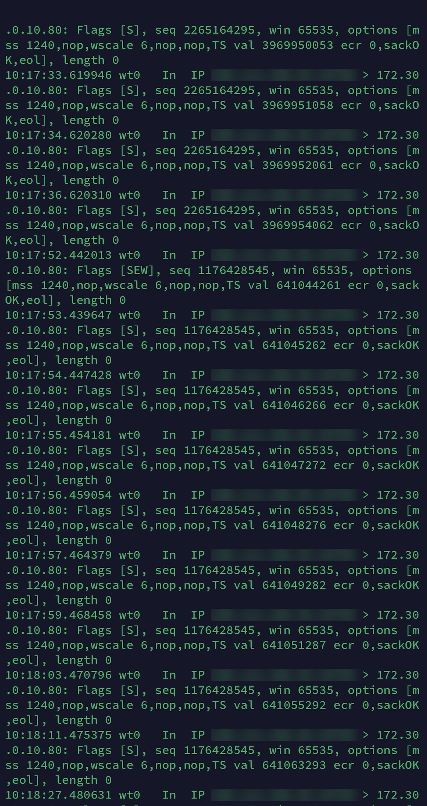
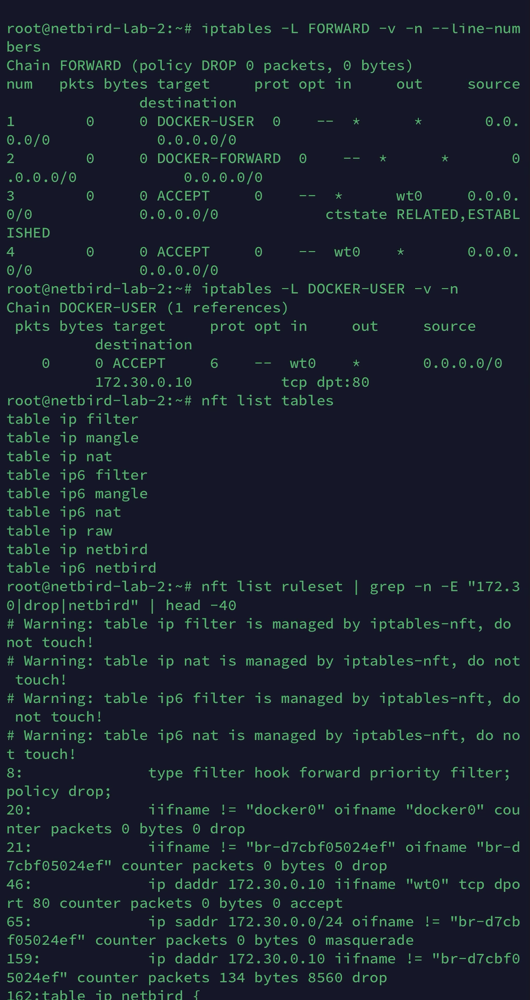
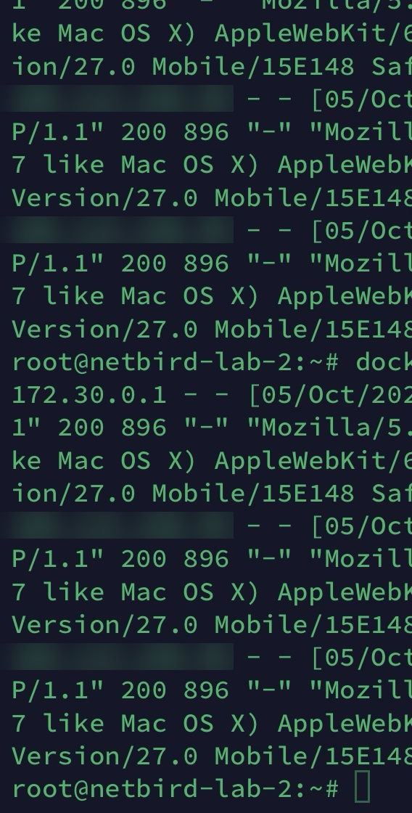
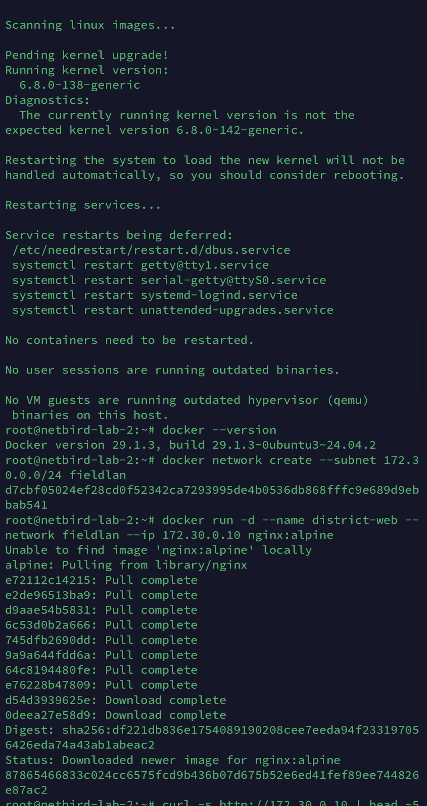

# Learning NetBird with a small "field office" lab

I'm an IT infrastructure officer at a public-health programme in Ghana. I look after a head office, a zonal office, 12 district offices and field teams, often over slow or unreliable links. I'm not a networking specialist. I'm the person who keeps everything connected, and I learn whatever the job needs.

At work I've set up site-to-site VPNs between head office and remote sites (one of them brought database sync time down from 450 ms to 120 ms). I kept hearing about peer-to-peer "zero trust" networks like [NetBird](https://netbird.io), so I wanted to try one properly: set it up, break it on purpose, and see what I could learn when things didn't work.

This is my lab notebook from 30 September to 5 October 2026, cleaned up. I did everything from my phone (SSH with Termius), on two cheap test servers that I deleted afterwards. I used an AI assistant as a guide while working through the lab and the debugging; every command was run by me, and the results and screenshots are my own. Where I couldn't work something out, I've said so.

## What I set up

- NetBird's free cloud plan, client version 0.79.0
- Two small Ubuntu 24.04 test servers on Hetzner, in different locations (`netbird-lab` and `netbird-lab-2`)
- My iPhone with the NetBird app
- On `netbird-lab-2`, a small Docker network (`172.30.0.0/24`) with a web server at `172.30.0.10`, pretending to be a district-office network



## Results at a glance

| Test | What happened |
|---|---|
| Server to server | Direct connection, about **35 ms** |
| Phone to server (office Wi-Fi and mobile data) | Went through NetBird's relay in Frankfurt, about **130-170 ms** |
| Blocking UDP with `iptables` | Didn't break anything: the connection moved to **IPv6** |
| Blocking UDP for IPv4 and IPv6 | Connection dropped and didn't recover through the relay in my test (I couldn't work out why) |
| Turning off the "allow everything" rule, then adding one rule for my phone | Access stopped, then came back only through my rule |
| Reaching the Docker "district office" from my phone | Didn't work at first: **Docker was dropping the traffic**. Fixed with one firewall rule |
| Turning masquerade off | Still worked in my setup (explained below) |

## What I learned

### 1. "Idle" and a slow first ping are normal

At first the server said `Status: Idle`, and I thought something was wrong. It turns out NetBird uses "lazy connections": it only opens a tunnel when something actually needs it.

That also explained my strangest result. The first pings between the two servers came back as 5198, 4167, 3143, 2119, 1095, then 71 ms. The replies were waiting while the tunnel started up, then all arrived together. Once the tunnel was up, the real numbers were steady at about 35 ms (34.8 / 35.1 / 35.4 ms min/avg/max).

**Lesson:** ignore the first few pings on an idle connection.

### 2. Direct vs relayed

NetBird tries to connect devices directly. If it can't, it sends traffic through a relay server.

| Path | Type | Ping |
|---|---|---|
| Server to server | Direct | about 35 ms |
| Phone on office Wi-Fi to server | Relayed (Frankfurt) | 127-214 ms |
| Phone on mobile data to server | Relayed (Frankfurt) | about 168 ms |

My phone never got a direct connection on either network. I think the office firewall and the mobile network's setup are the reasons, but I didn't test that, so I can't say for sure. The relay always worked, it's just slower: from Ghana through Frankfurt it added a lot of latency.

### 3. Blocking UDP didn't block anything (at first)

To see the relay take over, I blocked outgoing UDP on one server (keeping DNS working):

```
iptables -I OUTPUT -p udp ! --dport 53 -j DROP
```

Nothing changed: still direct, still 35 ms. When I looked closely at `netbird status -d`, the addresses had switched from IPv4 to IPv6. `iptables` only affects IPv4, and the servers also had IPv6, so NetBird used that instead. I hadn't expected that at all.

**Lesson:** if blocking something seems to have no effect, check IPv6 as well.

### 4. Blocking UDP fully: something I couldn't explain

When I blocked UDP for IPv6 too (`ip6tables`), the connection dropped: 40 pings with no reply. NetBird then switched to the relay, but the tunnel never actually came back up (no "handshake" showed in the status). `netbird up` also failed with `context deadline exceeded` while the block was in place. As soon as I removed the block, everything returned to normal.

I don't know why the relay didn't take over. My guess is that the other server hadn't switched yet, but I didn't check it at the time. Next time I'd look at both servers during the failure.

### 5. "Timed out" usually means the app is off

A few days later, SSH to a server's NetBird address just timed out. I assumed my SSH key had expired. It hadn't: the NetBird app on my phone had disconnected. Turning it back on fixed it.

I also noticed my NetBird setup keys had expired. Those are only used when adding a new machine, so they don't affect devices already connected.

**Lesson:** "connection timed out" means the request never arrived; check the app is connected before anything else.

### 6. Zero trust: allow only what's needed

1. With NetBird's default "allow everything" rule on, SSH from my phone worked.
2. When I turned that rule off, SSH stopped working.
3. I added one rule, `admins-ssh-to-servers` (my phone's group to the servers' group), and SSH worked again.

That was the moment the "zero trust" idea made sense to me: nothing is allowed unless a rule says so.

Looking at the policy map afterwards, I noticed my SSH rule was set to **All** protocols, so it allowed more than its name suggested. I changed it to TCP port 22 only. The map below shows the final rules: the default "allow everything" rule switched off (grey), SSH limited to TCP 22, and the district-office rule on TCP.



### 7. Reaching the "district office": finding a hidden drop

This was the part I learned the most from.

**Goal:** from my phone, open the web server at `172.30.0.10`, which only exists inside `netbird-lab-2`, the way head office would reach a district office's network.

**Setup in NetBird:** a network called `district-office`, with `netbird-lab-2` as the "routing peer" (the device that can reach that network), and a rule allowing my phone to reach it on port 80.

**Problem:** Safari just said the server stopped responding.

**How I found the cause, step by step:**

1. **Was the traffic even arriving?** I watched the traffic on the server with `tcpdump`. My phone's requests were arriving on NetBird's interface (`wt0`) and being retried, but nothing was going any further, and no reply came back.

   

2. **Was forwarding switched on?** Yes (`net.ipv4.ip_forward = 1`).
3. **First guess (wrong):** I added an allow rule in Docker's `DOCKER-USER` chain. Nothing changed, and its counter stayed at 0. Every counter in the `FORWARD` chain was 0 too, which meant the traffic wasn't getting that far.
4. **Looking at all the firewall rules with their counters** (`nft list ruleset`), I found one rule that had dropped exactly my traffic, 134 packets:

   ```
   ip daddr 172.30.0.10 iifname != "br-..." counter packets 134 bytes 8560 drop
   ```

   

   This is a rule Docker (version 29.1.3 here) adds in an early stage called the "raw" table. It blocks any traffic to a container's private address unless it comes from Docker's own network. My NetBird traffic counted as "outside", so it was dropped before reaching the rules I'd been looking at.
5. **The fix** was one rule, placed before Docker's drop:

   ```
   iptables -t raw -I PREROUTING -i wt0 -d 172.30.0.10 -p tcp --dport 80 -j ACCEPT
   ```

   After that the page loaded on my phone.

**What I took from it:** first check whether the traffic arrives, then follow the counters until you find where they stop going up. Also, my first guess was in the wrong place. The counters are what showed me that.

(These rules disappear on reboot, which was fine for a lab. For a real setup I'd need to find a proper permanent way to do this.)

### 8. Masquerade: I expected it to break, and it didn't

The routing peer has a "masquerade" setting: it makes traffic look as if it comes from the routing peer itself. I expected that turning it off would break the connection. It didn't, and the web server's log showed why:



| Masquerade | Who the web server saw | Worked? |
|---|---|---|
| On | `172.30.0.1` (the routing peer) | Yes |
| Off | My phone's own NetBird address (blurred above) | Yes |

With masquerade off, the web server could see which device was really connecting. It still worked because in my lab the routing peer is also the network's gateway, so it knew how to send replies back. As I understand it, in a real office with a separate router that doesn't know about NetBird's addresses, the replies would get lost, and masquerade (or an extra route on that router) would be needed. I haven't tested that case.

## If I were helping someone with a similar setup

- Check the NetBird app or service is connected first.
- "Idle" and a slow first ping aren't faults.
- Relayed means working but slower. It's worth finding out why a direct connection isn't possible.
- When blocking traffic, remember IPv6.
- If the routing peer also runs Docker, check Docker's firewall rules too.

## What I didn't cover

- Hosting NetBird's management server myself
- DNS settings and device posture checks
- More than one routing peer
- Why the relay didn't take over in finding 4

## Clean-up

Both test servers and their NetBird entries were deleted after the lab. The setup keys were single-use and expired after one day.


